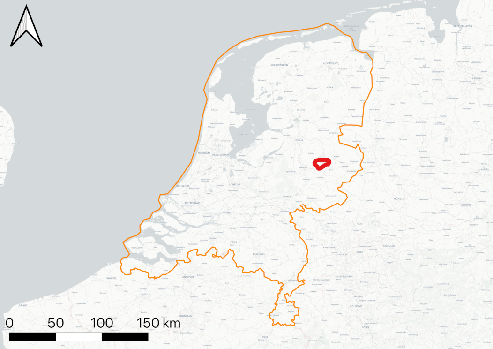
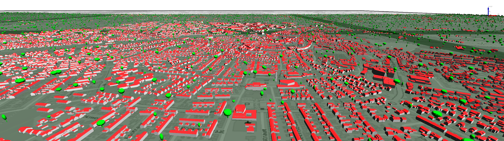

# CITYGML-BASED 3D CITY MODEL TESTBED FOR ENERGY-RELATED APPLICATIONS
This repository contains a open testbed for energy applications based on the CityGML v2.0 standard. The study area is located in the municipality of Rijssen-Holten
(circa 38.000 inhabitants, corresponding to circa 23.000 buildings) located in the eastern part of The Netherlands.

This dataset contains is split in three main categories:
1. Buildings

    We split the the CityGML building files into two main zip files, Holten and the other for Rijssen. Buildings are split into tiles according 3DBAG specification, further information is available at [https://3dbag.nl](https://3dbag.nl).

2. Digital Terraing Model

    We use the as the input data the AHN3 raster-based Digital Elevation Mdel (DEM). The input data is triangulated with a height tolerance of 20cm to reduce the number of triangules in the output data. We share a single CityGML file for the study area.

3. Vegetation

    Trees are modelled as *SolitaryVegetationObject* with implicit geometries in three level of detail (LoD1-LoD3).

The following image shows features from the three categories in QGIS.

## Citation
If you are using this testbed in a scientific context, please cite the following paper:

León-Sánchez, C., Agugiaro, G., and Stoter, J.: CREATION OF A CITYGML-BASED 3D CITY MODEL TESTBED FOR ENERGY-RELATED APPLICATIONS, Int. Arch. Photogramm. Remote Sens. Spatial Inf. Sci., XLVIII-4/W5-2022, 97–103, https://doi.org/10.5194/isprs-archives-XLVIII-4-W5-2022-97-2022, 2022 [[BibTeX](https://github.com/calsgeo/uem_testbed/blob/main/CITATION.bib)]